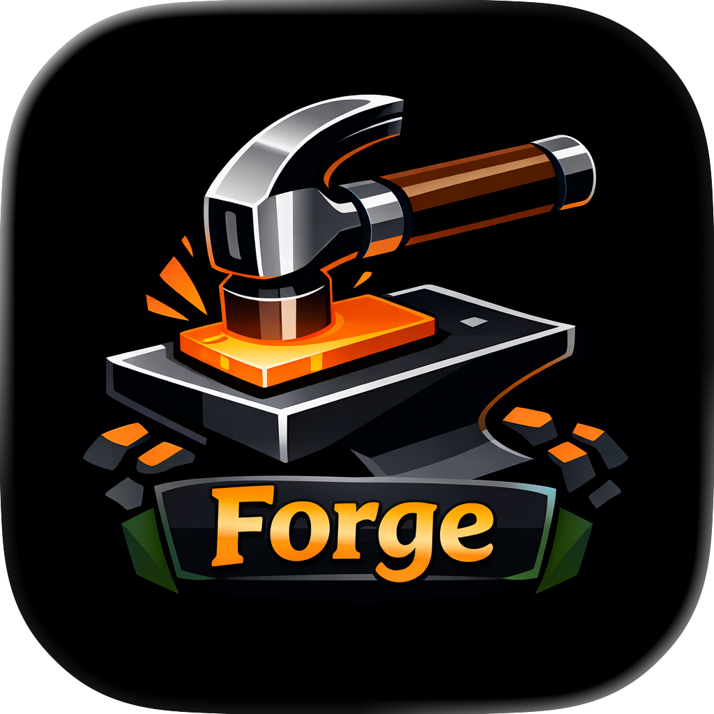
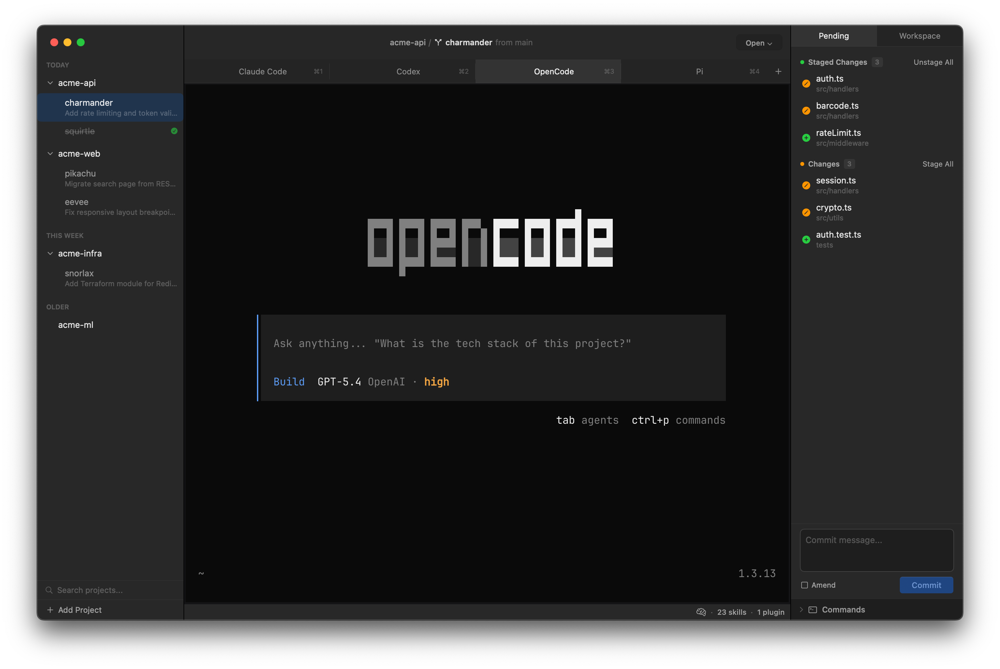

<p align="center">
  
</p>

# Forge

> [!WARNING]
> Lots of running to explore features - expect clanker slop underneath for now.

A native macOS terminal for local coding-agent workflows.

<p align="center">
  
</p>

## Why

Forge is [living personal software](#living-personal-software) built to make local coding-agent workflows easier to manage, focusing on:

- Running multiple agent sessions without losing track of what each one is doing
- Giving agents isolated workspaces for local changes
- Letting each agent keep its own CLI and TUI instead of forcing a generic abstraction
- Inspecting, reviewing, and feeding back on the work agents produce

## Core Concepts

**Projects** are Git repositories you add to Forge. They are the source of truth.

**Workspaces** are lightweight APFS CoW clones of a project with their own `forge/{name}` branch, so you can spin up isolated working copies, run agent sessions against them, and merge back when done.

## Features

- GPU-accelerated terminal via [Ghostty](https://ghostty.org), with tabs and arbitrarily nested split panes
- Project and workspace management with lightweight APFS CoW workspace cloning
- Agent-aware terminal sessions with live status, notifications, and agent launching
- Built-in Git status, diff, and review workflows with full file context and native text selection
- Fuzzy command palette with intent-based sections for quick navigation
- Workspace activity log with AI-powered summaries of agent work
- Project configuration via [`forge.json`](docs/forge-json.md) for processes, port allocation, lifecycle scripts, and Docker Compose stacks
- Customizable appearance and editor integration
- Bundled CLI for IPC and automation

## Project Configuration

Drop a [`forge.json`](docs/forge-json.md) in your project root to configure per-workspace:

- Processes - dev servers, watchers, Docker Compose stacks
- Ports - automatic allocation with environment variable injection so workspaces don't collide
- Lifecycle scripts - setup and teardown commands that run on workspace create/destroy

## Data Storage

Forge stores local state in `~/.forge/`:

```text
~/.forge/
  config.json
  projects.json
  state/
    sessions.json
    activity/
    forge.sock
  clones/
  reviews/
```

Per-project configuration lives in `forge.json` at the repository root (see [docs/forge-json.md](docs/forge-json.md)).

## Requirements

- macOS 15.0 or later
- Xcode 16.0 or later
- [XcodeGen](https://github.com/yonaskolb/XcodeGen)
- [SwiftFormat](https://github.com/nicklockwood/SwiftFormat)
- [SwiftLint](https://github.com/realm/SwiftLint)

## Development

Install the required developer tools:

```bash
brew install xcodegen swiftformat swiftlint
```

Common commands:

```bash
make                # Show all available targets
make deps
make project
make test
make build
make format
make lint
make release
make dev            # Run a development build (uses ~/.forge-dev for isolation)
make can-release
```

Open the project in Xcode after generating it:

```bash
open Forge.xcodeproj
```

## Dependencies

- [GhosttyKit](https://github.com/manaflow-ai/ghostty/releases) for GPU-accelerated terminal rendering, fetched by `make deps`
- [Bonsplit](https://bonsplit.alasdairmonk.com/) for split-pane management

`make project`, `make build`, and `make release` fetch the pinned GhosttyKit artifact automatically when it is missing.

## Living Personal Software

We now have the ability to build software tailored to our current needs in ways that are finally practical. Forge is a living tool that changes with my workflow as the software development space evolves at a rapid pace.

I think personal software is worth exploring more seriously: software shaped around how you want to work, not just how existing tools expect you to work. I hope someone finds this project useful, or better yet, is inspired to explore it with their agent and then make their own version.
